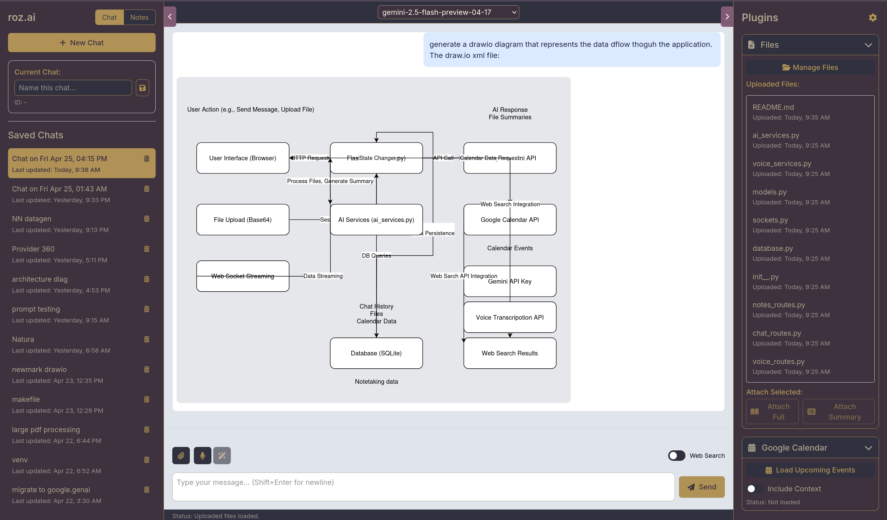
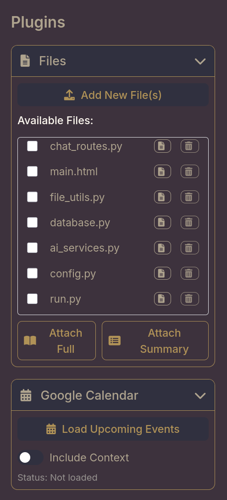
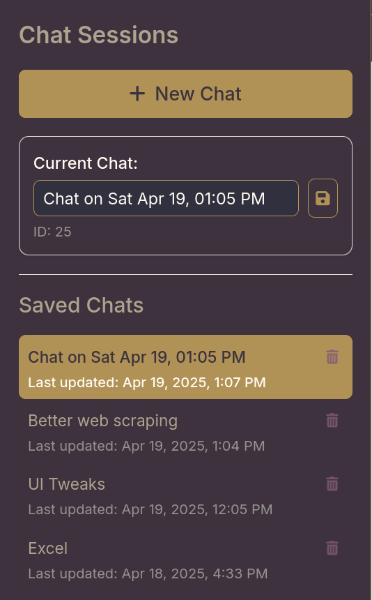
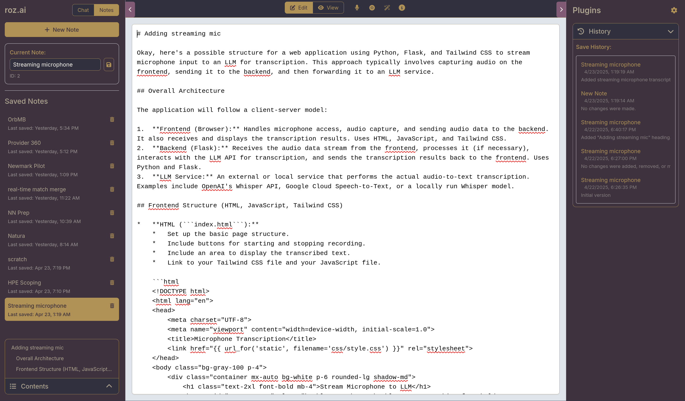
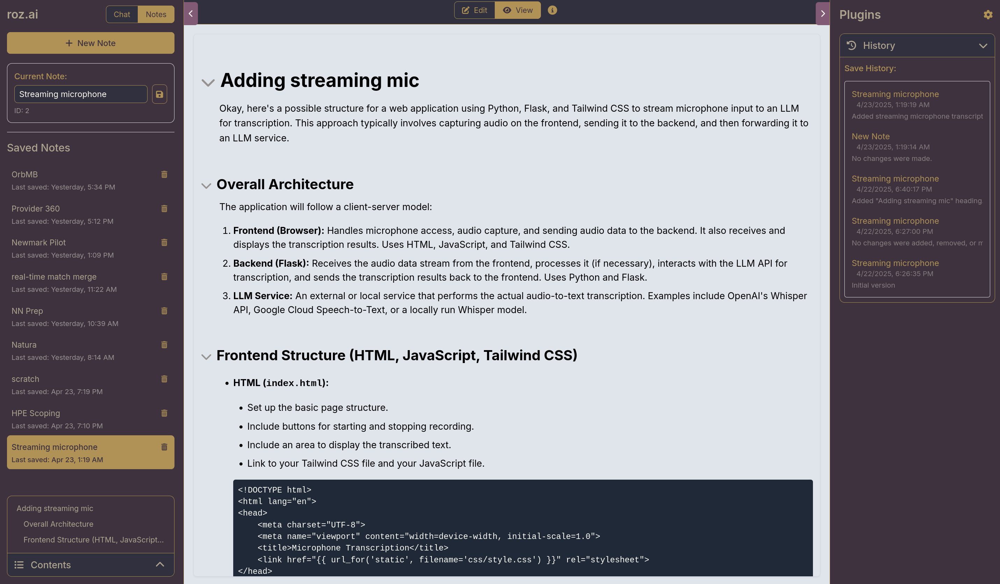

# roz.ai - Your Personal AI Assistant

roz.ai is a personal AI assistant tool built using Flask, Google Gemini API, and SQLite. It allows you to engage in conversational AI, upload and summarize files, integrate with Google Calendar, and perform web searches to enhance the AI's responses.

This is mostly an experiment in how far AI coding can take us. Aiming for as close to 100% of this code to be generated by AI tools. Using Aider and this web app itself to generate and manage code and features. 












## Features

*   **Chat Sessions:**
    *   Create and manage multiple chat sessions.
    *   Save and load chat history.
    *   Name and rename chat sessions for easy organization.
    *   Delete unwanted chat sessions.
*   **AI Powered by Google Gemini:**
    *   Leverages the Google Gemini API for intelligent conversation.
    *   Supports different Gemini models configurable within the app.
*   **File Upload and Summarization:**
    *   Upload various file types (text, code, documents, images, audio).
    *   Automatically generate summaries for uploaded files.
    *   Attach full files or summaries to chat conversations.
*   **Google Calendar Integration (Optional):**
    *   Load upcoming events from your Google Calendar.
    *   Include calendar context in your chat conversations.
*   **Web Search Integration (Optional):**
    *   Enable web search to augment the AI's knowledge with real-time information.
    *   Automatically generates and performs web searches based on your queries
*   **Session Files:**
    *   Upload files directly into the current chat session.
    *   Base64 encoding to pass to Gemini
*   **Notetaking:**
    *   Create, edit, and save notes directly within the application.
*   **Note History:**
    *   Access previous versions of your notes with a full history, allowing you to revert to earlier states and track changes. AI generated summaries between versions of notes are saved.
*   **Voice Transcription:**
    *   Transcribe audio into text using the integrated voice transcription service.  Supports both live streaming transcription and long running transcripton (great for transcribing meetings).
*   **AI Transcription Clean Up:**
    *   Leverage AI to clean up voice transcriptions, removing filler words and improving readability.
*   **Drawio Diagram Rendering:**
    *  Supports for rendering Drawio diagrams directly in the application.
*   **Deep Research Agent:**
    * Agent derives a research plan, executes initial research, updates, research plan, and executes research report.
*   **Auto Prompt Improver:**
    * Optionally send all promps to a LLM that will rewrite your prompt to improve effectiveness. 


## Technologies Used

*   **Flask:**  A lightweight Python web framework.
*   **Google Gemini API:** For AI-powered conversation and content generation.
*   **SQLite:**  A self-contained, serverless, zero-configuration, transactional SQL database engine.
*   **Tailwind CSS:**  A utility-first CSS framework for rapid UI development.
*   **HTML/CSS/JavaScript:** For the front-end interface.
*   **Werkzeug:** For file handling utilities.
*   **dotenv:**  For managing environment variables.
*   **marked:** For markdown parsing
*   **Flask SocketIO:** For Websocket streaming of voice transcription

## Prerequisites

*   **Python 3.8+**
*   **pip** (Python package installer)
*   **Google Gemini API Key:** You will need a valid API key from Google. Obtain one [here](https://makersuite.google.com/app/apikey).
*   **Google API Credentials (Optional for Google Calendar and Voice Transcription):** Instructions on obtaining this are outside the scope of this README.  For voice transcription, you'll need to enable the Cloud Speech-to-Text API and create a service account with appropriate permissions. Ensure the GOOGLE_APPLICATION_CREDENTIALS environment variable points to your service account key file.
*   **Google Cloud Storage Bucket (Optional for Long Voice Transcription):** Create a Google Cloud Storage bucket to store audio files for long-running transcription. Set the GCS_BUCKET_NAME environment variable to the name of your bucket.

## Installation

1.  **Clone the repository:**

    ```bash
    git clone <repository_url>
    cd roz.ai
    ```

2.  **Create a virtual environment (recommended):**

    ```bash
    python -m venv venv
    source venv/bin/activate  # On Linux/macOS
    venv\Scripts\activate  # On Windows
    ```

3.  **Install dependencies:**

    ```bash
    pip install -r requirements.txt
    ```

4.  **Configure environment variables:**

    *   Create a `.env` file in the project root directory.
    *   Add the following variables to the `.env` file:

        ```
        SECRET_KEY=<your_secret_key>  # Generate a strong, random key
        GEMINI_API_KEY=<your_gemini_api_key>
        # Optional Google API variables:
        GOOGLE_API_KEY=<your_google_api_key>
        GOOGLE_CSE_ID=<your_google_cse_id>
        GOOGLE_APPLICATION_CREDENTIALS=<path_to_your_google_service_account_key.json> # Required for voice transcription
        GCS_BUCKET_NAME=<your_google_cloud_storage_bucket_name> # Required for long voice transcription
        ```

    *Replace placeholders with your actual secret key and API keys.*

5.  **Initialize the database:**

    ```bash
    flask --app run init-db
    ```

## Running the Application

1.  **Run the Flask development server:**

    ```bash
    flask --app run run
    ```

2.  **Access the application in your web browser:**

    *   Open your web browser and navigate to `http://127.0.0.1:5678` (or the address shown in the terminal).

## Usage

*   **Chat Sessions:** Use the left sidebar to create new chat sessions, load existing chats, rename chats, and delete chats.
*   **File Upload:**  Use the "Files" plugin on the right sidebar to upload files. You can then attach full files or summaries to your chat messages.
*   **Google Calendar:**  Use the "Google Calendar" plugin to load upcoming events and include them in your chat context. Toggle the "Include Context" switch to activate or deactivate calendar integration.
*   **Web Search:** Enable the "Web Search" toggle below the input area to make AI include web search results in it's context.
*   **Send Messages:** Type your message in the input area and click the "Send" button.
*   **File Attachments (Session):** Upload files using the paperclip button to attach files directly to the message in the current chat session.
*   **Notetaking:** Access the notes section from the navigation bar. Create, edit, and save notes. View note history.
*   **Voice Transcription:** Use the voice transcription feature in the voice tab of the right sidebar. Record audio directly or upload existing audio files. After recording you can use the clean up tool to clean the transcript.

## Key Shortcuts

_(Add specific keyboard shortcuts here once known)_

*   **Ctrl+S:** Save current note (Example)
*   **Ctrl+N:** Create new note (Example)
*   ...

## Configuration

The `app/config.py` file contains various configuration options, including:

*   `SECRET_KEY`:  Used for session management and security. **Important:** Change this to a strong, random key in production.
*   `DEBUG`: Enables or disables debug mode.
*   `DB_NAME`:  Specifies the name of the SQLite database file.
*   `ALLOWED_EXTENSIONS`: Defines the file extensions allowed for upload.
*   `MAX_FILE_SIZE_MB`: Sets the maximum file size for uploads (in MB).
*   `API_KEY`:  Your Google Gemini API key.
*   `DEFAULT_MODEL`:  The default Gemini model used for chat responses.
*   `SUMMARY_MODEL`:  The Gemini model used specifically for file summarization.
*   `AVAILABLE_MODELS`:  A list of Gemini models available for selection in the UI
*   `GEMINI_REQUEST_TIMEOUT`: Timeout for Gemini API calls in seconds
*   `GCS_BUCKET_NAME`: The name of your Google Cloud Storage bucket (required for long voice transcription)

You can modify these options by editing the `app/config.py` file or setting the corresponding environment variables.

## Database Structure

The application uses an SQLite database with the following tables:

*   `chats`: Stores chat session information (id, name, created\_at, last\_updated\_at, model\_name).
*   `messages`: Stores chat messages (id, chat\_id, role, content, timestamp).
*   `files`: Stores file metadata and content (id, filename, content, mimetype, filesize, summary, uploaded\_at).
*   `notes`: Stores note information (id, name, content, created\_at, last\_saved\_at).
*   `note_history`: Stores previous versions of notes (id, note\_id, name, content, note\_diff, saved\_at).

## Future Enhancements

*   **Improved Google Calendar Integration:**  Provide a more feature-rich calendar integration.
*   **Better File Handing:** Improve interface for loading and managing files
*   **Drawio Diagram Rendering:** Render Drawio diagrams directly in the application.
*   **Plugin Architecture:**  Develop a plugin architecture to easily extend the functionality of the tool.
*   **RAG Plugin:** All chats, notes, and documents and indexed and searchable
*   **Agentic Workflows:** Add agents that can complete tasks
*   **Tool use:** Add additional tools beyond web search

## Contributing

Let's be honest. No one is going to conmtribute to this. Or see it. 

## License

[MIT License](LICENSE) (Replace with the appropriate license if different).
